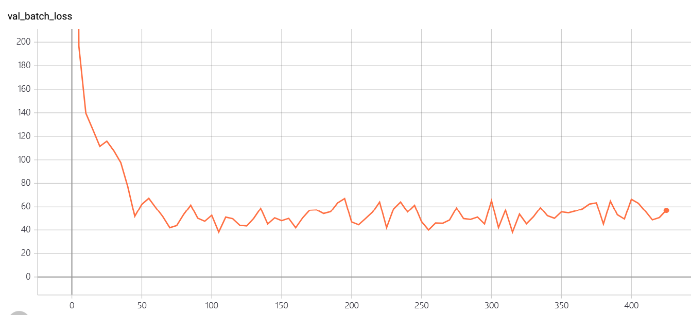

# TransE implementation 

--------------------------
## Introduction
Implementation of the TransE model for the knowledge graph representation.

## Code Structure

`utils.py` contains basic **Triple** class, its comparison, and other basic computations. It also contains the code for computing head-tail proportion for each relation, classifying relations into 1-1, 1-N, N-1 and N-N, and dividing triples according to them. For fairness, the evaluation is borrowed from previous work.

`evaluation.py` is evaluating the model in two metrics: meanrank and hits@10. We use multi-processing to speed up computation. For fairness, the evaluation is borrowed from previous work.

`data.py` contains various ways to generate negative triples and get a batch of training samples and its corresponding negative samples. For fairness, the evaluation is borrowed from previous work.

`models.py` contains the loss functions used in our algorithms, of which the most important is margin loss and orthogonal loss.

`train.py` The main logic(training/vaildation procedure) is written in this file. If you want to reproduce the result, you can execute this file. 

## Usage

Our programs are all written in Python 3.8, PyTorch 1.5. The GPU is required for training the model.

Usage:
python train.py -d DATASET_NAME

For the knowledge representation, we mainly use the WN11 and WN18 (WordNet) for experiments.

The model will be evaluated during training. For validation and LR scheduling, we will randomly take a batch of triples from the validation for evaluations, and use this validation loss for LR scheduling.
During the fix of epoch number, will test model on test set. Evaluation result on the test set will be written into ./result/[dataset].txt, such as ./result/WN11.txt. 
All intermediate result will be plot by Tensorboard,

## Experiments and Results

We test the model on WordNet18 dataset. This dataset contains the commonsense knowledge of large amount the entity set. There are multiple kinds of relationships, such as: "part_of", "similar_to", "instance_hypernym", etc. 
The corresponding relationships are diverse too, this dataset contains 4 kinds of relationships: one to one, one to many, many to one, many to many.

The evaluation metrics we use are mean ranking and top 10 hit rate for evaluating the head/tail completion of relationships. The top 10 hit rate is the percentage of the correct the head/tail is retrieve from the top 10 nearest neighbors after the translation.

The performance of TranE on WN18 test set, the corrupted triples in test set are removed.
| relationship type (to predict) | hit@10 | mean ranking |
| ------------------------------ | ------ | ------------ |
| one_to_one(head)               | 85.74  | 947.1        |
| one_to_many(head)              | 93.34  | 464.18       |
| many_to_one(head)              | 85.61  | 654.96       |
| many_to_many(head)             | 87.25  | 581.75       |
| one_to_one(tail)               | 88.09  | 865.66       |
| one_to_many(tail)              | 84.56  | 776.19       |
| many_to_one(tail)              | 93.84  | 378.569      |
| many_to_many(tail)             | 89.20  | 599.75       |
| avg                            | 89.08  | 574.9        |

During the training, we dynamically reduce the learning rate when validation performance reach the plateau.
The training procedure is plotted by the tensorboard

training loss

validation loss

The performance on validation set:

hit@10

mean ranking

The learning rate scheduling:

hit@10

# How it really works
The relational knowledge can be represented as directed graph structure, the nodes are the entities and the edges are the relationship between the entities. Specific, the relationships can be represented as triples <head, relation, tail>.

The main idea of TransE model is represent the entities by embedding space, and using the displacement in embedding space to represent the relational information between the entities. 
The entities are the vectors/points in embedding space.
The relationship between the entities is also a vector in space, that represent the translation between the entities.

Specifically, the model is a set of embedding matrix $W_h, W_t, W_t \in \mathcal{R}^{N,D}$, that can embedding the the symbolic entities and relationship from the one-hot vectors $\mathbf{r}_{oh}, \mathbf{t}_{oh}, \mathbf{h}_{oh} \in \mathcal{1,0}^{N}$ to the distributed representation vectors $\mathbf{r}, \mathbf{t}, \mathbf{h} \in \mathcal{R}^D$ in embedding space. 
$$
\begin{aligned}
\mathbf{r} &= \mathbf{t} - \mathbf{h} \\ 
 W_t \mathbf{r}_{oh} &= W_t \mathbf{t}_{oh} - W_h \mathbf{h}_{oh}
\end{aligned}
$$

As shown in the figure, the head entity, tail entity, relation entity are represented by the vector of embedding space respectively. The TransE is such a embedding parameters that can encode each entities and relationship into embedding space with such attribution.

## Learning
To achieve such a goal, a margin-based ranking object function was proposed for optimizing the embedding parameters $W_h, W_t, W_t$ in training phrases. The object function $L_{margin}$ is criterion that evaluated how the entities close in positive relationship triplets $S = \{<h,r,t>\}$, and push the entities away in negative relationship triplets $S' = \{<h,r,t'>, <h',r,t'>, <h',r,t>\}$ with a margin $m$.   
$$
L_{margin} = \sum_{h,r,t \in S} \sum_{h',r',t' \in S'}[dist(\mathbf{h + r, t}) - dist(\mathbf{h + r, t}) + m]
$$
The distance function $dist(\cdot, \cdot)$ can be L1 or L2. Further more, for avoiding the overfitting, there a regularity term for embedding vectors that constrain the magnitude of vector in embedding space.
$$
L_{norm} = || W_t ||_2 + || W_h ||_2 + || W_r ||_2 \\
$$
The norm of the embedding vectors of each batch $L_{norm}$ is add to total loss $L$.
$$
L  = L_{norm} + L_{margin}
$$

The embedding weight is update by the SGD, according to the gradient of $L$ related to weights.

## Inference
During the inference phrase, the goal is to predict the head and entities of incomplete relation triplets.

As shown in figure, for given head/tail entities and relationship, we can embedding the given symbols, and calculate the embedding of missing symbols' embedding vector $\hat{t}$ by the translation constraint introduces in learning section.
$$
\mathbf{\hat{t}} = \mathbf{h} + \mathbf{r} \\ 
$$
Then we can mapping the embedding vector $\hat{t}$ to its symbol id by compare the nearest neighbors according to the learned embedding vector with the same distance function in learning phrase.
In this way, we can get a set of possible missing entities class with a distance value. 

# Acknowledge
The code is partially borrowed from the https://github.com/jimmywangheng/knowledge_representation_pytorch/ . (data preprocess, evaluation).  Thanks for his nice  implementation.
